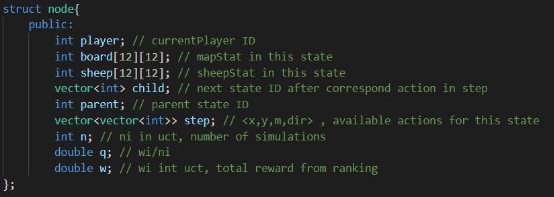

Report for Game Project – BattleSheep 

Team  ID:  17 Team name: I don’t know 

Team  member:  0816095  王軒,  0816136  林佑庭,  0816144  寸少康 

\1.  Used Algorithm. 

Monte Carlo Tree Search with Upper Confidence Bounds to Trees(UCT) algorithm. 

UCT:  

` `( ) + × √

- *wi* : the number of wins for the node considered after the *i*-th move 
- *ni* : the number of simulations for the node considered after the *i*-th move 
- *Ni* : the total number of simulations after the *i*-th move run by the parent node of the one considered 
- *c* is the exploration parameter—theoretically equal to √2; in practice usually chosen empirically 

(source: wikipedia) 

Data Structure: 

Tree: a vector of struct node struct node: 

Global variables: 

There are four functions for MCTS implementation:  

1. selection: select a leaf node which have maximum uct value 
1. expansion: find all possible actions from the selected leaf node 
1. simulation: randomly simulate game from the selected leaf node’s state until it reaches the resulting state of the game. 
1. backprop: Update information(n,w,q) in the nodes.  

Pruning methods: 

1. Stop MCTS if running time over TO. 

`  `check runtime after each iteration, break loop if time exceed. 

2. Stop MCTS if player has no available movement to early. 

`  `if player has no available when all other player can still move for three turn. 

Decision to Initial Position: 

1. find a position with 4 or more available direction, avoid block by others. 

For example: purple position has four available directions, green position has five available direction. (the picture lower left) They are the position we could choose. 

2. If there are multiple possibilities, find the smallest sum position of distance to the split position of all direction. We think this method can block some narrow entry more easily. 

For example: 

In the right picture, the marked position p has four available directions: 2, 3, 4, 6.  The distance between p and its split position along direction 3 is 6. 

Similarly, the sum of distance of p is 1+6+2+2=11 (correspond to dir 2, 3, 4, 6). 

2. Experiments and Experiences 

Parameter: Reward for each ranking 

Results of experiments, 20 times in total, exploration\_constant = 2.5: 

|Number of Ranking |{ 0.7, 0.2, 0.1, 0.0 } |{ 1.0, 0.0, 0.0, 0.0 } |{ 0.5, 0.3, 0.15, 0.05 } |{ 0.4, 0.3, 0.2, 0.1 } |
| - | - | - | - | - |
|1 (3) |6 |6 |4 |5 |
|2 (1) |4 |2 |6 |7 |
|3 (-1) |6 |4 |6 |5 |
|4 (-3) |4 |8 |4 |3 |
|Final score |4 |-8 |0 |8 |
choose { 0.4, 0.3, 0.2, 0.1 } as the reward. 

Exploration Constant 

Results of experiments, 20 times in total, Reward = { 0.4, 0.3, 0.2, 0.1 }: 

|Number of Ranking |1.41 |2.5 |5 |10 |
| - | - | - | - | - |
|1 (3) |5 |4 |8 |3 |
|2 (1) |5 |7 |6 |2 |
|3 (-1) |4 |5 |1 |10 |
|4 (-3) |6 |4 |5 |5 |
|Final score |-2 |4 |14 |-14 |
choose 5 as Exploration Constant 

How to pick a proper initial position? 

We want to use MCTS to choose an initial position at first. Due to massive calculation, we gave up this method and trying to figure out a conservative algorithm to find a good position. 

We thought that it is better to have multiple available direction for occupying more landscape. Connection of landscapes has lower priority. So, we choose the positions that have more than 3 available direction at first stage. Then pick the positions that might near an entry of a cave aggressively. 

3. Contributions 

Thoughts, discussion:  王軒,  寸少康,  林佑庭 coding:  林佑庭 

Debug:  王軒,  寸少康 

report:  林佑庭 
